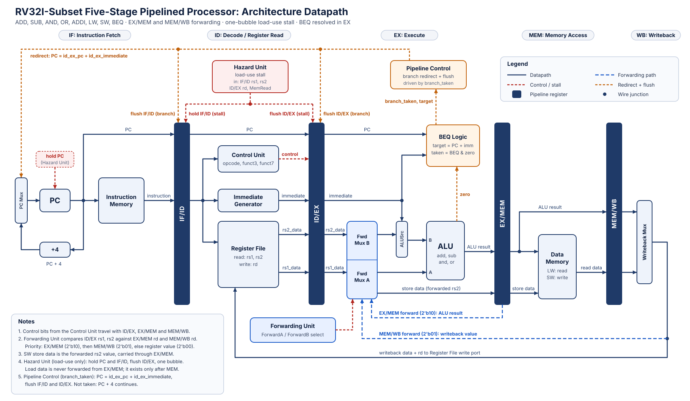
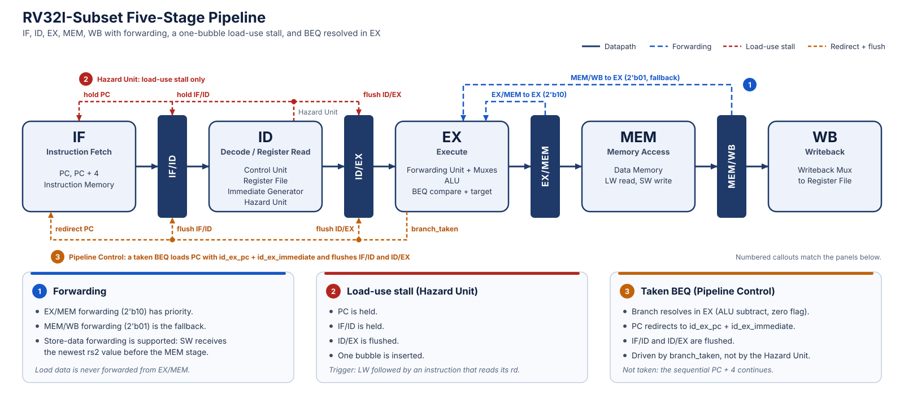

# Pipelined RV32I Processor

This repository contains a compact, simulation-focused 32-bit processor
implemented in SystemVerilog. It supports a deliberately small RV32I subset
and demonstrates a complete five-stage pipeline, data-hazard handling, branch
handling, waveform inspection, and assertion-based verification.

## Architecture

The datapath and pipeline are documented in these reviewed SVG diagrams:





The architecture diagram shows the main datapath, pipeline registers,
writeback path, forwarding paths, load-use stall control, and separate branch
redirect/flush control. The pipeline diagram shows instruction movement
through IF, ID, EX, MEM, and WB together with the tested hazard behaviors.

The pipeline stages are:

| Stage | Responsibility |
| --- | --- |
| IF | Use the PC to fetch an instruction and compute the sequential PC. |
| ID | Decode the instruction, read `rs1`/`rs2`, and generate an immediate. |
| EX | Select forwarded operands, execute the ALU operation, and resolve `BEQ`. |
| MEM | Read or write data memory for `LW` and `SW`. |
| WB | Select the ALU result or loaded data and write the destination register. |

The stages are separated by `IF/ID`, `ID/EX`, `EX/MEM`, and `MEM/WB` pipeline
registers. The design uses word-aligned addresses: `address[9:2]` selects one
of 256 memory words.

## Supported instruction subset

| Instruction | Format | Operation | Main controls |
| --- | --- | --- | --- |
| `ADD rd, rs1, rs2` | R | `rd = rs1 + rs2` | `RegWrite`, ALU add |
| `SUB rd, rs1, rs2` | R | `rd = rs1 - rs2` | `RegWrite`, ALU subtract |
| `AND rd, rs1, rs2` | R | `rd = rs1 & rs2` | `RegWrite`, ALU AND |
| `OR rd, rs1, rs2` | R | `rd = rs1 \| rs2` | `RegWrite`, ALU OR |
| `ADDI rd, rs1, imm` | I | `rd = rs1 + imm` | `RegWrite`, immediate ALU input |
| `LW rd, imm(rs1)` | I | `rd = Mem[rs1 + imm]` | `MemRead`, `MemToReg`, `RegWrite` |
| `SW rs2, imm(rs1)` | S | `Mem[rs1 + imm] = rs2` | `MemWrite` |
| `BEQ rs1, rs2, imm` | B | branch if `rs1 == rs2` | branch control, ALU subtract |

The immediate generator implements I-, S-, and B-type encodings. Unsupported
or illegal instructions are converted into invalid pipeline work and do not
write architectural state.

## Repository layout

```text
rtl/       Reusable components and CPU implementations
tb/        Self-checking component and integration testbenches
programs/  Instruction-memory initialization files
docs/      Architecture diagrams and inspected waveform evidence
build/     Generated simulator outputs (ignored by Git)
```

Important modules include:

- [`rtl/alu.sv`](./rtl/alu.sv) — arithmetic and logical operations
- [`rtl/register_file.sv`](./rtl/register_file.sv) — two reads, one write,
  reset, hard-wired `x0`, and same-cycle write-through
- [`rtl/immediate_generator.sv`](./rtl/immediate_generator.sv) — I/S/B immediates
- [`rtl/control_unit.sv`](./rtl/control_unit.sv) — instruction decoding
- [`rtl/single_cycle_cpu.sv`](./rtl/single_cycle_cpu.sv) — single-cycle reference
- [`rtl/pipelined_cpu.sv`](./rtl/pipelined_cpu.sv) — five-stage integration
- [`rtl/forwarding_unit.sv`](./rtl/forwarding_unit.sv) — forwarding selection
- [`rtl/hazard_unit.sv`](./rtl/hazard_unit.sv) — load-use detection
- [`rtl/cpu_assertions.sv`](./rtl/cpu_assertions.sv) — portable checks

## Hazard handling

### ALU-result forwarding

The forwarding unit compares the source registers in ID/EX with destinations
in later stages. It selects:

| Selection | Source |
| --- | --- |
| `2'b10` | EX/MEM ALU result |
| `2'b01` | MEM/WB writeback value |
| `2'b00` | Value read into ID/EX |

EX/MEM has priority because it contains the newest result. Loads are excluded
from EX/MEM forwarding because their data is not available until the MEM stage.
The directed test includes dependencies such as:

```text
ADD x3, x1, x2
SW  x3, 0(x5)       # store-data forwarding
```

and:

```text
LW  x6, 0(x5)
ADD x7, x6, x1      # load-use dependency
```

### Load-use stall

When a load in ID/EX writes the register consumed by the instruction in IF/ID,
the hazard unit asserts `stall`. The pipeline then:

1. Holds the PC.
2. Holds the IF/ID register.
3. Flushes ID/EX, inserting one bubble.

After the load advances, the dependent instruction proceeds with the loaded
value available through the normal writeback path.

### Branch handling

`BEQ` is resolved in EX by subtracting the forwarded operands and checking the
ALU zero flag. A taken branch uses `id_ex_pc + id_ex_immediate` as its target
and flushes the younger IF/ID and ID/EX instructions. A not-taken branch uses
the sequential PC.

## Verification strategy

The testbenches are self-checking and fail with `$fatal` when an architectural
result, control event, or coverage condition is incorrect.

| Test area | What is checked |
| --- | --- |
| Components | ALU operations, zero flag, register-file reset/write/x0 behavior, immediates, and decoding |
| Single-cycle CPU | Arithmetic, logic, load/store, taken branch, skipped instruction, reset, and x0 |
| EX/MEM forwarding | Back-to-back ALU dependency |
| MEM/WB forwarding | Dependency on an older producer |
| Store forwarding | Recently produced value used by `SW` |
| Load-use hazard | Stall, PC/IF-ID hold, and ID/EX bubble |
| Branches | Taken redirect/flush and not-taken sequential flow |
| Assertions | Reset PC, x0 invariant, store control, valid writeback destination, and stall behavior |
| Waveform | VCD generation and visual inspection of reset, flow, forwarding, stalls, and branches |

The five checks in [`rtl/cpu_assertions.sv`](./rtl/cpu_assertions.sv) use
immediate assertions sampled on the falling clock edge. This is intentional:
it preserves automated assertion checks while remaining compatible with
lightweight open-source simulators that do not provide complete concurrent-SVA
support.

## Waveform evidence

The pipeline testbench writes `build/pipelined_cpu.vcd`. The inspected
screenshots are retained as documentation:

| Screenshot | Evidence |
| --- | --- |
| [`pipeline-reset-and-flow.png`](./docs/waves/pipeline-reset-and-flow.png) | Reset release and valid instructions moving through the stages |
| [`forwarding-paths.png`](./docs/waves/forwarding-paths.png) | EX/MEM and MEM/WB forwarding selections |
| [`load-use-stall.png`](./docs/waves/load-use-stall.png) | Stall assertion, held PC/IF-ID, and ID/EX bubble |
| [`branch-control-flow.png`](./docs/waves/branch-control-flow.png) | Taken branch target and wrong-path flush |

To inspect the complete signal-level waveform locally:

```sh
gtkwave build/pipelined_cpu.vcd
```

## Build and run

Install Icarus Verilog with SystemVerilog support. GTKWave is optional and is
only needed for interactive waveform inspection. Then run:

```sh
make test
```

Focused commands are:

```sh
make test-components
make test-single-cycle
make test-pipeline
make clean
```

The complete regression should print:

```text
PASS: component tests
PASS: single-cycle CPU tests
PASS: pipelined CPU tests
```

The Makefile uses Icarus Verilog with `-g2012`. Generated `.vvp` files and VCD
files are placed under `build/`, which is excluded from version control.

## Deliberate limitations

This is an educational RV32I-subset processor, not a complete RISC-V
implementation. It intentionally does not include:

- Instructions outside the eight-entry subset above
- Byte or halfword accesses and load/store alignment exceptions
- CSR, trap, interrupt, privilege, or exception handling
- Multiplication, division, floating point, or compressed instructions
- Caches, bus protocols, or external peripherals
- Dynamic branch prediction or a branch target buffer

These boundaries keep the implementation small enough to inspect and verify
while demonstrating the intended RTL, pipeline, hazard, and verification
fundamentals.
